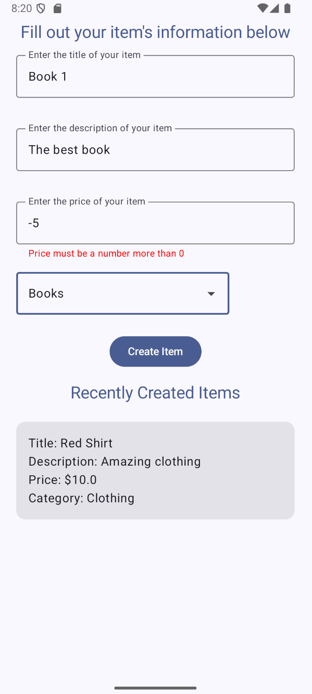
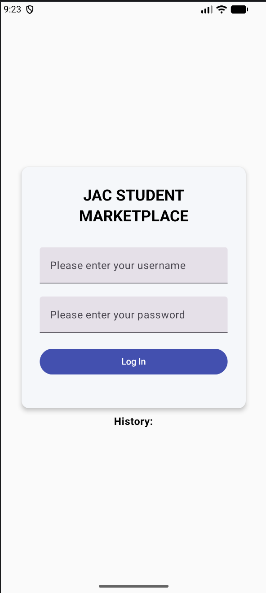

# JACpot Student Marketplace

## Our Goal!

Our application's goal is to be a dedicated, user-friendly pnline marketplace designed specifically for John Abbott College. Its purpose is to create a welcoming space where students can easily connect to buy, sell, and request academic materials and everyday essentials from their peers.

## Quick-start

Build and run JACpot from this repository. The Gradle wrapper is included, so you do not install Gradle yourself. The first build downloads Gradle 9.5.1.

### Desktop

From the repo root:

```bat
gradlew.bat :desktopApp:run
```

This compiles the project and opens the desktop window. To build a Windows installer instead of launching the app:

```bat
gradlew.bat :desktopApp:packageMsi
```

The installer is written under `desktopApp/build/compose/binaries/main/msi/`.

### Android

From the repo root, with a device or emulator connected:

```bat
gradlew.bat :androidApp:installDebug
```

To build the APK without installing it:

```bat
gradlew.bat :androidApp:assembleDebug
```

The APK is `androidApp/build/outputs/apk/debug/androidApp-debug.apk`. The application id is `com.example.multiplatformapplication`.

### Web

From the repo root:

```bat
gradlew.bat :webApp:wasmJsBrowserDevelopmentRun
```

Gradle starts a local dev server and opens the app in a browser. Leave that process running while you use the site.

## Screenshots of application

- (by Sprint 1): Screenshots from each of the main screens of your application.


### Create Item to create

This screen is where users can enter the information for the item they wish to sell



### Login Screen

This screen is where users log in.


## Team members

List each person's name and email address.
Jaden Mayoff ([MayoffJaden@gmail.com](mailto:MayoffJaden@gmail.com))
Christopher Cardoza ([cardozachristopher1@gmail.com](mailto:cardozachristopher1@gmail.com))
Luca Maiolo ([lucamaiolo07@gmail.com](mailto:lucamaiolo07@gmail.com))